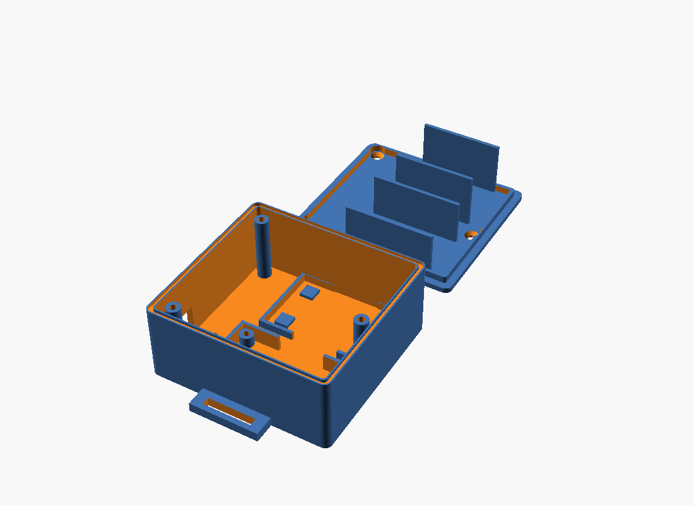

# eBike logger box (ESP32 DevKit V1 + microSD module)

A two-part printed box for the bridge: ESP32 DevKit V1 (30 pin) and the 6-pin SPI microSD module, with a lid that
seals against splashes, a cable exit with strain relief, and tabs for a strap. It also works loose in a bag.

Files:
- `ebike_logger_box.scad`: the parametric model (OpenSCAD). Change the numbers at the top, render, print.
- `stl/ebike_logger_base.stl`, `stl/ebike_logger_lid.stl`: ready to print with the default sizes below.
- Rebuild: `openscad -o stl/ebike_logger_base.stl -D 'part="base"' ebike_logger_box.scad` (and `part="lid"`).

**Not test printed yet.** Print the base first and check the boards drop in before you print the lid.

## Sizes used (check them with calipers)

| Part | Size | Where it matters |
|---|---|---|
| ESP32 board | 52 x 29 mm; 13 mm overall with the pins, about 4.6 mm of it above the PCB underside | pocket and lid height |
| microSD module | 48 x 31 mm, 5 mm high | pocket |
| Box outside | 78 x 74 x 35 mm (93 mm long with the strap tabs) | |

Things the model assumes that you should verify on your boards:
- **The ESP32's header pins point down**, about 8.5 mm long, with the female connectors on them hanging below the board.
  `esp[2]` (4.6 mm) is the height from the underside of the PCB to the top of the USB socket (PCB 1.6 + socket about 3).
  `usb_center_z` is worked out from the pillar height so the cable slot lines up with the socket.
- **`esp_edge_z`** is the highest point along the board's long edges (header pin tips above the PCB). **`sd_edge_z`** (5 mm) is the same for the SD module.
- **`card_overhang`** (2.5 mm) is how far the microSD card sticks out of the module when fully inserted.
- **`wire_clear`** (8 mm) is the headroom above the ESP32 up to the lid.

## Mounting the ESP32 board on pillars

The ESP32 board is screwed down through four holes, **46 mm along the board x 24 mm across**, centred on the
board's area. Each hole has a **20 mm pillar**, so the board sits 20 mm above the floor. That space is for the header
pins (which point down) and the female wire connectors on them. The wires leave through the finger notches in the
board's rim, towards the SD module.

**Screws.** Flat countersunk head, 90 degrees, head 4.7 mm across and 1.5 mm high, M2.5, PZ1 (from the shop drawing).
The length includes the head, which sits flush in the underside of the box. The stack, from the bottom of the box up:

| Layer | mm |
|---|---|
| Floor | 2.4 |
| Pillar | 20 |
| ESP32 PCB | 1.6 |
| M2.5 washer | 0.5 |
| M2.5 nut | 2.0 |
| Thread past the nut | 1.0 |
| **Minimum screw length** | **27.5, so use M2.5 x 30** |

A 20 mm screw only allows a 12.5 mm pillar (`esp_standoff = 12.5`). The model prints the minimum screw length when
you render it.

- Put a nylon washer or a plain washer under the nut to protect the PCB. Nylon screws also work.
- **Read from photos, not measured.** The 46 x 24 mm spacing is what you gave me; the hole diameter (2.7 mm) is my
  estimate. Measure the board's real holes and edit `mount_holes`, `mount_d` (3.4 for M3), and `mount_offset` if the
  holes are not centred on the board. Pillar height is `esp_standoff`, its outside diameter `standoff_d` (6 mm).
- `mount_enable = false` leaves the floor plain, and the board then needs to be held by the rim and the lid only.
- The microSD module has no mounting holes in this design: it rests on four small 1.5 mm pads and is held by its rim,
  the lid ribs and the end wall.
- `part="section"` renders a cut through the hole row (`preview_section.png`), to check the pillars.

## What it does about the SD card

The boards sit in low rims so they cannot slide. The lid has ribs that press down on the board edges; stick a
**2 mm self-adhesive foam strip** on each rib tip so they press instead of rattle. The microSD module sits so that the
card's edge is only 0.6 mm from the end wall (`card_stop`): the card cannot spring out of its push-push slot, and
the box stays closed with the card inside.

Wiring matters more than the box. A loose Dupont wire or a card that works free was the likely cause of the write
failures. For a ride logger, **solder short wires** (about 8 cm) between the module and the ESP32 (VCC, GND, CS,
MOSI, MISO, SCK) rather than using push-on connectors, and keep VCC and GND short and thick.

## Print settings

- **PETG** (or ASA). PLA softens in a hot bag or in the sun.
- 0.2 mm layers, 3 walls, 20 % infill, no supports. Base opens upward. **Print the lid upside down** (flat face on the bed, as exported).
- The lid ribs for the SD module are about 19 mm tall and thin. Print slowly if they wobble.

## Shopping list

- 3 x M3 x 10-12 mm screws (self-tapping into the printed bosses, or use M3 heat-set inserts and set `screw_pilot = 4.2`).
- 2 mm self-adhesive foam strip (about 20 cm).
- Optional: 2 mm round rubber cord or a TPU gasket for the groove in the rim (set `gasket = false` if you do not want it).
- 1 or 2 short zip ties for the USB cable strain relief, and a 20 mm Velcro or webbing strap for the frame.

## Assembly

1. Solder the six wires if you are doing that. Drop the ESP32 into its rim (USB end towards the cable slot) and the microSD module into its rim, card slot end towards the far wall.
2. Plug in the USB cable, pass it through the slot, and tie it to the floor with a zip tie through the two slots (this keeps the plug from being pulled).
3. Press the foam strips onto the rib tips, lay the gasket cord in the groove, close the lid and fit the three screws.
4. For the frame: pass the strap through the two tab slots and over the lid, then around the tube.

## Limits

- It is **splash resistant, not waterproof**. The cable slot is open around the plug. Keep it out of direct spray, or add a bead of silicone around the cable once the length is final.
- No vents: the ESP32 and card produce little heat, but do not leave it in direct sun.
- The ESP32's status LED is not visible. Check the app instead.
